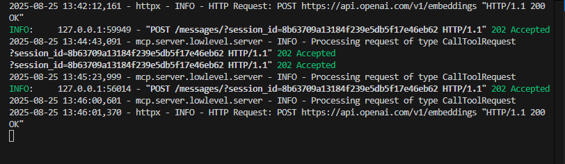
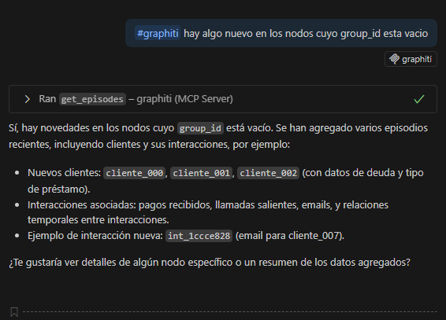
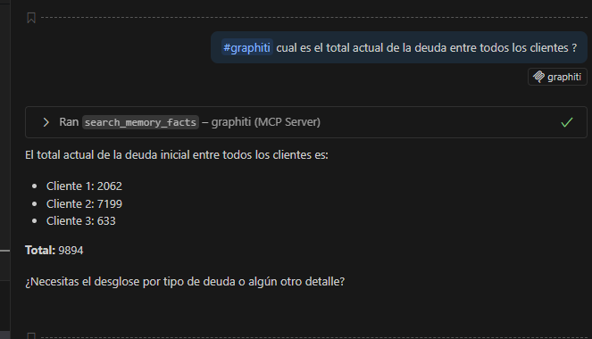
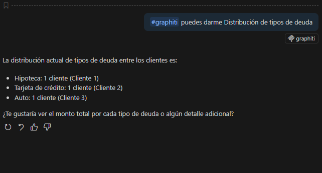

# Prueba Técnica – Analizador de Patrones de Llamadas
## 1. Descripción del Proyecto

1. **Sistema de ingesta y modelado de grafo** para clientes, agentes, interacciones, promesas y pagos.
2. **API de consultas** basada en lenguaje natural utilizando MCP y GitHub Copilot/LLM.
3. **Visualización web** (no desarrollada en esta prueba; enfoque principal en ingesta y API).

El objetivo es demostrar capacidad de modelado de datos, construcción de consultas y preparación de métricas útiles para análisis de deuda y comportamiento de clientes.

---

## 2. Sistema de Ingesta y Modelado de Grafo (40%)

### 2.1 Decisiones de Modelado

#### En este caso no se uso la API REST ya que no funcionaba al momento de ingresar los datos correspondiente,
* **Nodos principales**:

  * `Cliente`
  * `Agente`
* **Interacciones**:

  * Capturan acciones de cobro/gestión.
  * Ordenadas temporalmente mediante nodos intermedios `SIGUIENTE_INTERACCION`.
* **Promesas y pagos**:

  * Modelados como nodos separados para facilitar consultas sobre cumplimiento.
  * Cada pago puede vincularse a la promesa correspondiente mediante `interaccion_id`.
* **Relaciones temporales**:

  * `SIGUIENTE_INTERACCION` permite modelar la secuencia de eventos por cliente.
* **Group\_id**:

  * Clasifica nodos para búsquedas y reportes rápidos.

### 2.2 Datos derivados pre-calculados

Se almacenan propiedades en nodos `Cliente` para acelerar consultas:

* `ultimo_pago_fecha`: Fecha del último pago registrado.
* `monto_pagado_total`: Total pagado por cliente.
* `estado_deuda`: Pendiente, incumplida o completada.
* `cantidad_promesas_cumplidas/incumplidas`
* `fecha_ultima_interaccion`
* `promedio_dias_respuesta`: Entre promesa y pago.

### 2.3 Consideraciones Adicionales

* **Evolución temporal de la deuda**:
  Capturada mediante nodos de interacciones con timestamps, permitiendo calcular cuánto debía el cliente en cada momento y cómo evoluciona con pagos o renegociaciones.

* **Conexión entre promesas y pagos reales**:
  Permite analizar cumplimiento, tiempos de pago y detectar patrones.

* **Información derivada valiosa**:
  Métricas útiles para negocio: monto total pagado, cumplimiento de promesas, fecha de última interacción, tiempos promedio de respuesta.

---

## 3. API de Consultas (30%)

* Se configuró un **servidor MCP** para recibir consultas en lenguaje natural.
* Integración con **GitHub Copilot / OpenAI** para interpretación de lenguaje natural.
* Permite extraer métricas y responder preguntas como:

  * “¿Cuál es el monto total pagado por cliente X?”
  * “Mostrar clientes con promesas incumplidas en los últimos 30 días.”
* La API está lista para consultas aunque no se desarrolló el frontend web.

---

## 4. Visualización Web (30%)

> ⚠️ No se avanzó en el desarrollo del frontend.
> La preparación de datos y la configuración del MCP permiten que cualquier visualización futura sea sencilla de integrar.

---


## 5. Instrucciones de Instalación

1. **Clonar repositorio**

```bash
git clone <REPO_URL>
cd <REPO>
```

2. **Carga de grafos**

```bash
cd load && pip install -r requirements.txt
source venv/script/active # source venv/bin/active
python carga.py # Este archivo creara los grafo y todo lo necesario para la carga en graphiti
```

3. **Levantar servidor MCP**

```bash
cd mcp/mcp_server  && uv sync  
cp .env.template .env 
uv run graphiti_mcp_server.py --model gpt-4.1-mini --transport sse
```


---

## 7. Conclusión

Me parecio interesante este proyecto y si bien no lo pude terminar al 100% en el tiempo establecido , de modo que para la persona que lee esto me gustaria saber si hay algun tipo de problema con que lo termine de resolver y lo suba a mi github a fin de mantenerlo como parte del portafolio, Saludos. LF


### 8. Capturas de la solución 


configuración del servidor mcp , basicamente extraje el del repo principal lo copie aca y lo coloque en modo desarrollo.



consultas con lenguaje natural con pocos datos 




mas consultas 






### Preguntas para Reflexionar

1. Ventajas de usar un grafo vs. base relacional

Relaciones naturales: clientes, agentes, interacciones y pagos se modelan directo, sin JOINs costosos.

Flexibilidad: agregar nuevos tipos de nodos/relaciones sin modificar esquemas.

Consultas complejas: más fáciles de expresar (ej. incumplimientos después de varias interacciones).

Análisis avanzado: soporta inferencias, detección de patrones y conexión con LLMs.

2. Escalabilidad a 1 millón de clientes

Infraestructura: motor de grafo distribuido (Neo4j cluster, TigerGraph, AWS Neptune).

Particionamiento: por group_id o periodo para consultas rápidas.

Ingesta: batch/streaming con colas (Kafka + workers).

Optimización: índices en cliente_id, precálculo de métricas en nodos.

Analítica: métricas agregadas en almacenes tipo BigQuery; grafo reservado para consultas relacionales.

3. Otras fuentes de datos útiles

Canales de contacto: WhatsApp, SMS, email.

Socioeconómicos: ubicación, historial crediticio, ingresos.

Agentes: desempeño de gestores.

Comportamiento digital: uso de portal/app.

Contexto externo: inflación, desempleo, estacionalidad.